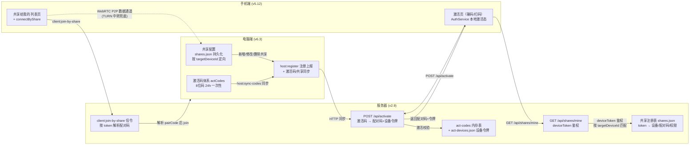
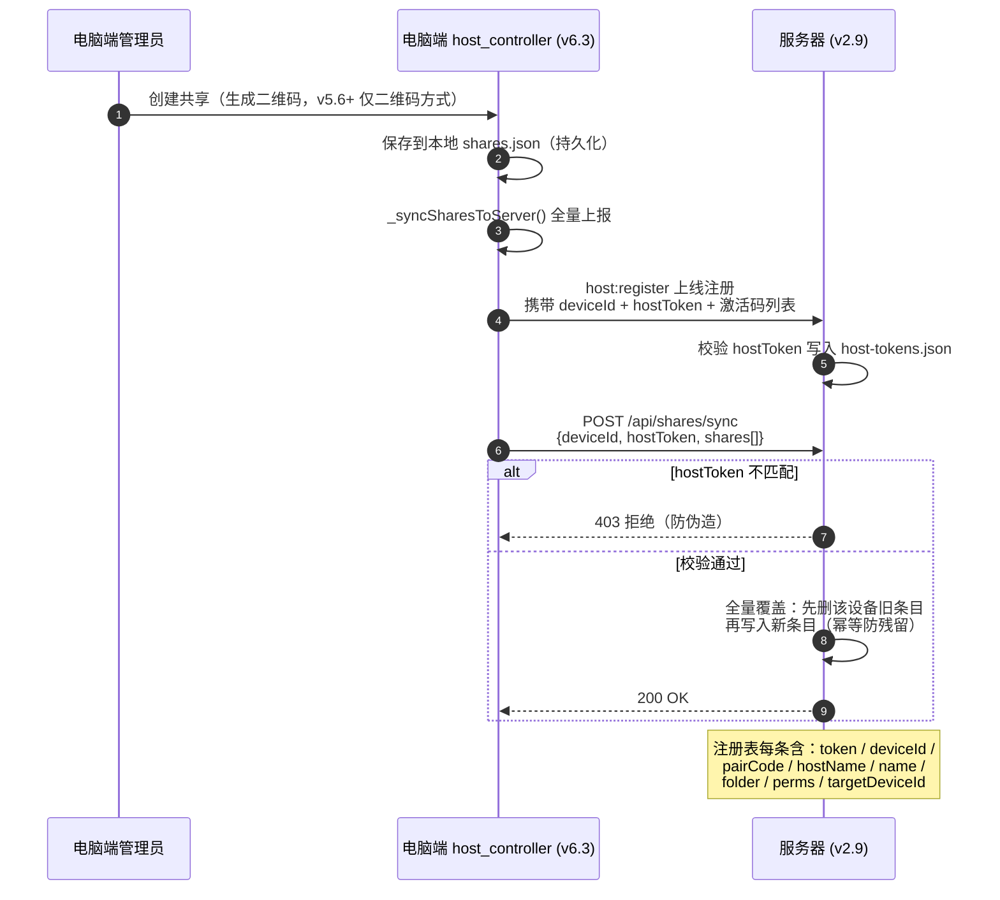
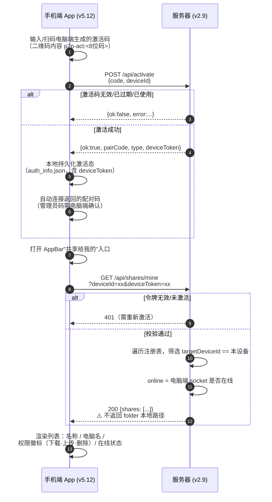
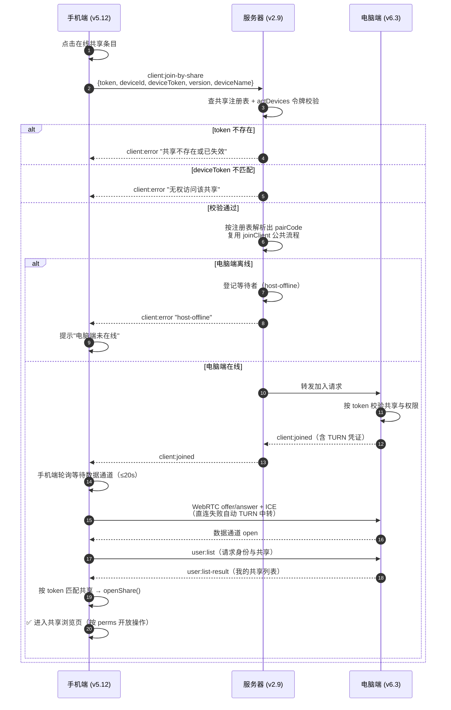
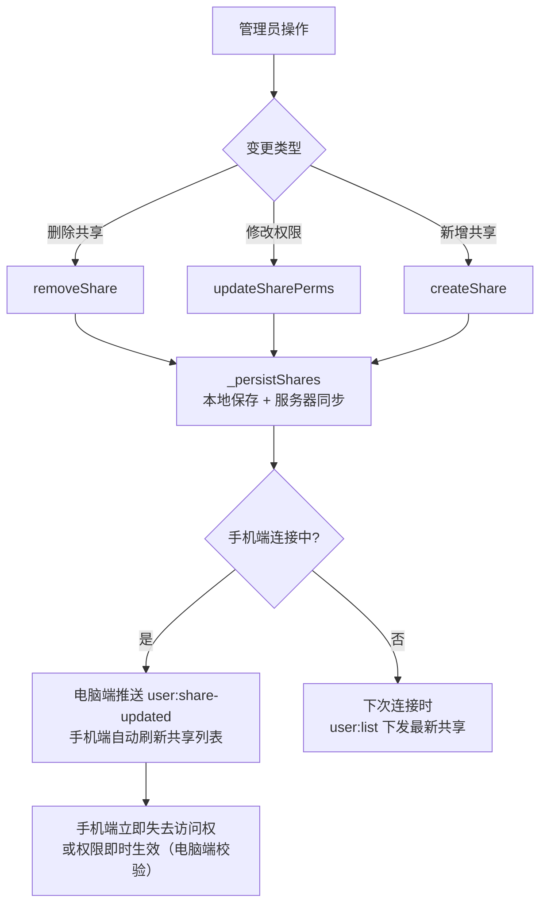
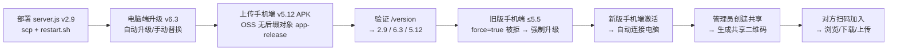

# 免配对码共享连接 · 流程文档（v2.9+ 无限大盘版）

> 功能目标：手机端凭电脑端生成的**激活码**激活本设备后，即可在"共享给我的"中看到电脑端管理员创建的共享，并**免配对码**直接连接、浏览、下载/上传。
>
> 全程无手机号、无注册/登录/短信；服务器不存任何用户个人信息，仅存临时凭证（激活码/设备令牌）。

## 版本信息

| 端 | 版本 | 关键文件 | 状态 |
|---|---|---|---|
| 服务器 | v2.13 | `p2p-app/server.js` | ✅ 已部署（`/opt/p2p-app`） |
| 电脑端 | v6.18 | `host_controller.dart` / `users_manage_page.dart` | ✅ 已发布 |
| 手机端 | v5.25 | `activate_page.dart` / `auth_service.dart` / `update_check.dart` | ✅ 已发布（旧版 ≤v5.5 强制升级，仅 arm64-v8a） |

> **v2.7+ 强制升级（更名“无限大盘”）**：产品名由“P2P 文件助手”改为“无限大盘”；
> 服务器设置手机端最低可用版本 `MIN_ANDROID_VERSION = '5.6'`，低于该版本的手机端：
> - `/update-check` 返回 `force: true` → 新版客户端弹**不可跳过**的强制升级窗（仅“立即更新”/“退出应用”）
> - `/api/activate`、`client:join`、`client:join-by-share` 一律拒绝（`APP_VERSION_REQUIRED`）→ 旧版无法激活/连接，必须升级后才能正常使用

---

## 一、系统架构



---

## 二、核心流程

### 2.1 流程一：电脑端共享同步到服务器



### 2.2 流程二：手机端激活并拉取"共享给我的"列表



### 2.3 流程三：免配对码连接握手（核心）



### 2.4 流程四：共享生命周期变更



---

## 三、关键机制说明

| 机制 | 说明 |
|---|---|
| **激活码体系（替代手机号）** | 电脑端本地生成 8 位大写字母+数字激活码（管理员码/普通码），24 小时有效、一次性使用；手机端 POST /api/activate 兑换 `{pairCode, type, deviceToken}`；管理员码首次连接需电脑端弹窗确认后成为管理员 |
| **hostToken 防伪造** | 电脑端首次运行生成 32 位随机 hex（`Random.secure`），落盘 `%APPDATA%/p2p_desktop/host_token`；服务器按 deviceId 记录，sync 接口令牌不匹配返回 403，防止他人冒充电脑端写入共享 |
| **deviceToken 鉴权** | 激活时由服务器按 `deviceId:时间戳` HMAC 派生 32 位令牌（act-devices.json 持久化）；`/api/shares/mine` 与 join-by-share 均以它校验设备身份，不依赖任何登录态 |
| **全量覆盖同步** | `POST /api/shares/sync` 每次先删该设备全部旧条目再写入，天然幂等，避免电脑端删除共享后服务器残留幽灵条目 |
| **路径不外泄** | `GET /api/shares/mine` 不返回 `folder` 字段，手机端只能拿到 token/名称/电脑名/权限/在线状态 |
| **权限统一校验** | 连接时电脑端仍按 token 校验共享与权限（与扫码/免配对码同一代码路径）；服务器仅做入口转发 |
| **host-offline 等待登记** | 电脑端离线时服务器登记等待者，电脑端注册上线后补发 `client:joined`（手机端自动重连恢复） |
| **共享持久化** | 电脑端 `Documents/p2p_desktop_logs/shares.json` 落盘，重启恢复后重新同步，保证注册表与本地一致 |
| **配对信息隔离** | 免配对码连接标记 `isShareGuest`，不写入手机端配对历史，界面只开放共享功能 |
| **连接密码（数据通道内）** | 管理员可为用户设置连接密码（电脑端本地 SHA256+salt 哈希），手机端通道打开后自动校验 `auth:verify`；密码全程不经过服务器 |

## 四、异常场景矩阵

| 场景 | 表现 | 处理 |
|---|---|---|
| 激活码无效/已过期 | 激活页提示错误 | 向电脑端管理员重新索要激活码 |
| 激活码已使用 | 激活页提示"已被使用" | 激活码一次性，需管理员重新生成 |
| 管理员码待确认 | 激活成功但连接未建立 | 电脑端弹窗确认后自动连接 |
| 电脑端未开机 | 列表显示"离线"灰色 | 点击提示"该共享的电脑不在线" |
| 电脑端开机但网络抖动 | join 后 15s 无响应 | 手机端超时兜底 → 返回连接失败提示 |
| 共享被删除/电脑端重装 | 服务器无此 token | `client:error "共享不存在或已失效"` → 下拉刷新列表消失 |
| 设备令牌失效（服务器重启后重激活） | `/api/shares/mine` 401 | 重新用激活码激活本设备（原设备旧令牌自动撤销） |
| 连接密码错误/被重置 | 通道被踢出，主页弹密码框 | 输入正确密码后自动重连；被重置时提示获取新密码 |
| 管理员修改权限 | 手机端在浏览中 | 电脑端推送 `user:share-updated`，操作按钮即时按新权限刷新 |
| 服务器重启 | 激活码表清空、注册表从 `shares.json` 恢复 | 电脑端 socket 重连后重新注册并全量同步；已激活设备令牌从 `act-devices.json` 恢复 |
| 手机端版本过低（≤v5.5） | 激活/连接被拒 `APP_VERSION_REQUIRED` | 弹强制升级窗（不可跳过），下载安装最新版后恢复 |

## 五、部署与验证清单



**验证命令**

```bash
# 服务器版本
curl http://182.92.157.93:3000/version

# 升级检查（旧版应返回 force:true；新版 force:false）
curl "http://182.92.157.93:3000/update-check?platform=android&version=5.5"
curl "http://182.92.157.93:3000/update-check?platform=android&version=5.7"
curl "http://182.92.157.93:3000/update-check?platform=desktop&version=6.0"

# 已删除的手机号相关接口（应 404）
curl -X POST http://182.92.157.93:3000/api/register
curl -X POST http://182.92.157.93:3000/api/login
curl -X POST http://182.92.157.93:3000/api/send-sms
```

**排查日志位置**

- 电脑端：`Documents\p2p_desktop_logs\`（含"共享已同步到服务器: N 条"、激活码生成/撤销记录）
- 手机端：App 内"复制运行日志"（含激活、join-by-share、拉取共享列表、连接握手全过程）
- 服务器：`/opt/p2p-app/server.log`（`[激活]` 标签记录激活码发放/兑换全过程）
