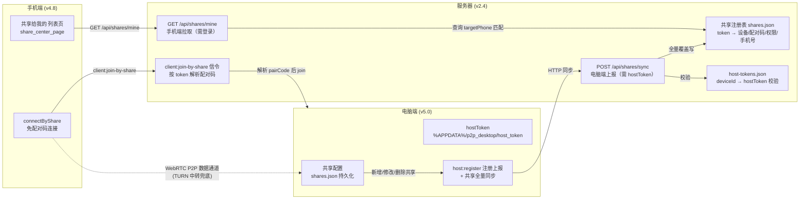
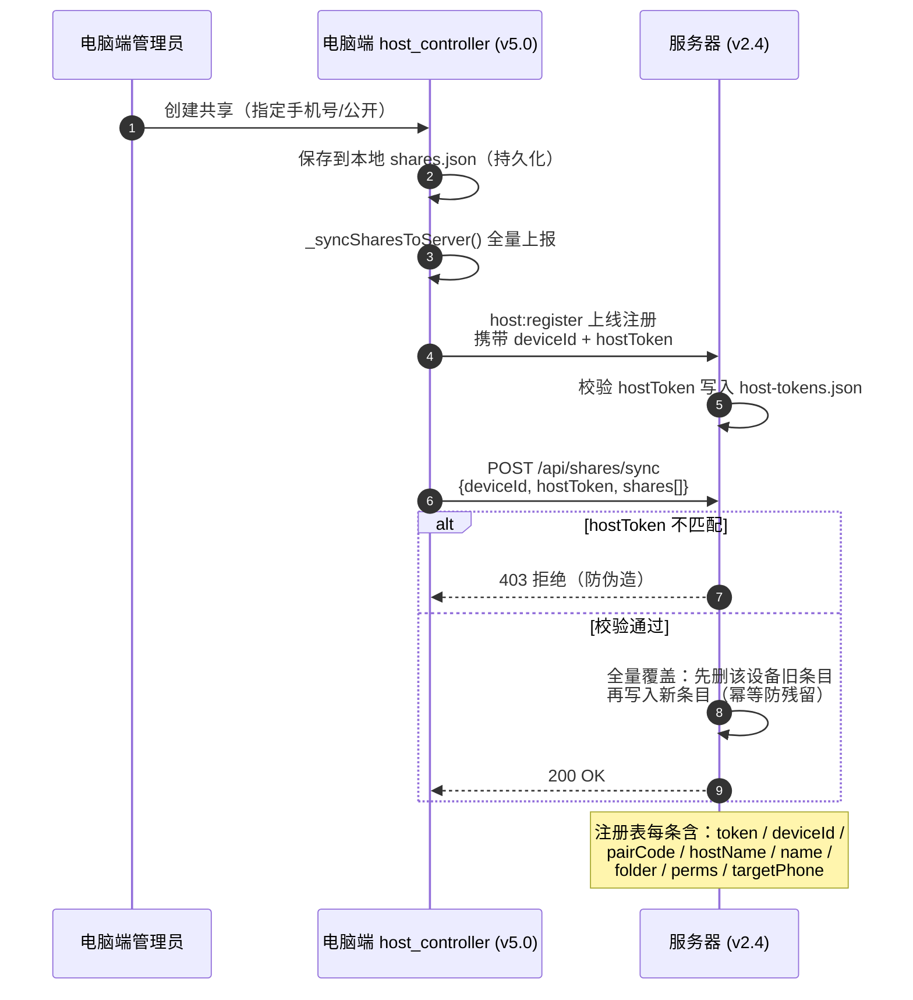
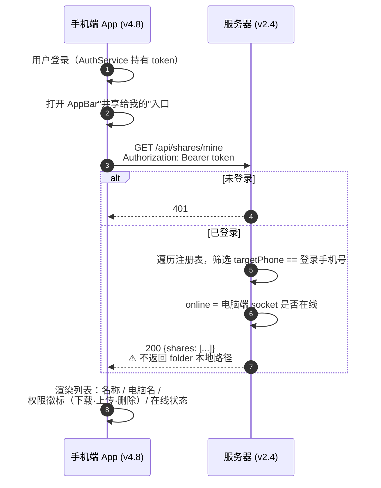
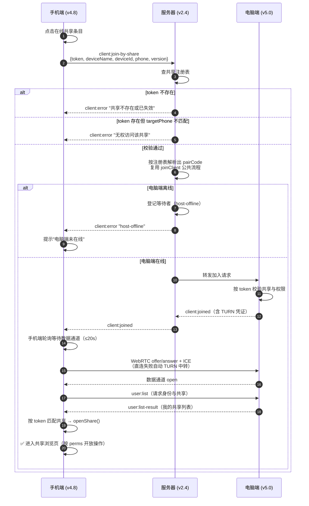
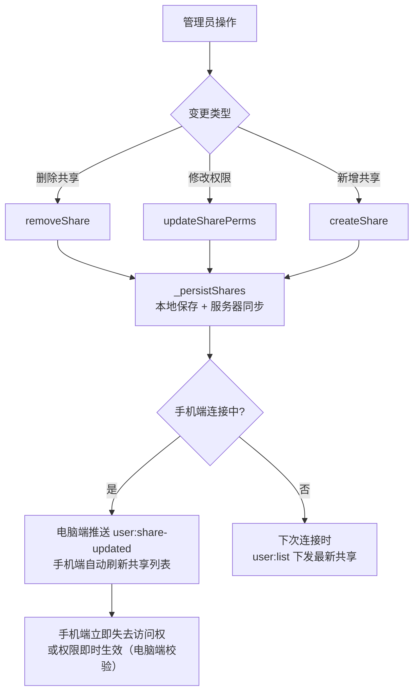

# 免配对码共享连接 · 流程文档

> 功能目标：用户 B 从未连接过任何电脑，只要电脑端管理员给 B 的手机号创建过共享，B 登录 App 后即可在"共享给我的"中看到该共享并**免配对码**直接连接、浏览、下载/上传。

## 版本信息

| 端 | 版本 | 关键文件 | 状态 |
|---|---|---|---|
| 服务器 | v2.4 | `p2p-app/server.js` | ✅ 已部署（`/opt/p2p-app`） |
| 电脑端 | v5.0 | `host_service.dart` / `host_controller.dart` | ✅ 已构建上传 |
| 手机端 | v4.8 | `share_center_page.dart` / `app_controller.dart` | ✅ 已构建上传 |

---

## 一、系统架构



---

## 二、核心流程

### 2.1 流程一：电脑端共享同步到服务器



### 2.2 流程二：手机端拉取"共享给我的"列表



### 2.3 流程三：免配对码连接握手（核心）



### 2.4 流程四：共享生命周期变更



---

## 三、关键机制说明

| 机制 | 说明 |
|---|---|
| **hostToken 防伪造** | 电脑端首次运行生成 32 位随机 hex（`Random.secure`），落盘 `%APPDATA%/p2p_desktop/host_token`；服务器按 deviceId 记录，sync 接口令牌不匹配返回 403，防止他人冒充电脑端写入共享 |
| **全量覆盖同步** | `POST /api/shares/sync` 每次先删该设备全部旧条目再写入，天然幂等，避免电脑端删除共享后服务器残留幽灵条目 |
| **路径不外泄** | `GET /api/shares/mine` 不返回 `folder` 字段，手机端只能拿到 token/名称/电脑名/权限/在线状态 |
| **权限统一校验** | 连接时电脑端仍按 token 校验共享与权限（与扫码/免配对码同一代码路径）；服务器仅做入口转发 |
| **host-offline 等待登记** | 电脑端离线时服务器登记等待者，电脑端注册上线后补发 `client:joined`（手机端自动重连恢复） |
| **共享持久化** | 电脑端 `Documents/p2p_desktop_logs/shares.json` 落盘，重启恢复后重新同步，保证注册表与本地一致 |
| **配对信息隔离** | 免配对码连接标记 `isShareGuest`，不写入手机端配对历史，界面只开放共享功能 |

## 四、异常场景矩阵

| 场景 | 表现 | 处理 |
|---|---|---|
| 电脑端未开机 | 列表显示"离线"灰色 | 点击提示"该共享的电脑不在线" |
| 电脑端开机但网络抖动 | join 后 15s 无响应 | 手机端超时兜底 → 返回连接失败提示 |
| 共享被删除/电脑端重装 | 服务器无此 token | `client:error "共享不存在或已失效"` → 下拉刷新列表消失 |
| 用户未登录 | AppBar 无"共享给我的"入口 | 登录后常显 |
| 管理员修改权限 | 手机端在浏览中 | 电脑端推送 `user:share-updated`，操作按钮即时按新权限刷新 |
| 服务器重启 | 注册表从 `shares.json` 恢复 | 电脑端 socket 重连后重新注册并全量同步 |

## 五、部署与验证清单

```mermaid
flowchart LR
    A[部署 server.js v2.4<br/>scp + restart.sh] --> B[电脑端替换 v5.0 exe<br/>重启]
    B --> C[手机端安装 v4.8 APK]
    C --> D[验证 /version<br/>→ 2.4 / 5.0 / 4.8]
    D --> E[管理员创建共享<br/>指定用户手机号]
    E --> F[用户登录<br/>打开"共享给我的"]
    F --> G[看到共享 → 点击连接<br/>→ 浏览/下载/上传]
```

**验证命令**

```bash
# 服务器版本
curl http://182.92.157.93:3000/version

# 升级检查
curl "http://182.92.157.93:3000/update-check?platform=android&version=4.7"
curl "http://182.92.157.93:3000/update-check?platform=windows&version=4.9"
```

**排查日志位置**

- 电脑端：`Documents\p2p_desktop_logs\`（含"共享已同步到服务器: N 条"）
- 手机端：App 内"复制运行日志"（含 join-by-share、拉取共享列表、连接握手全过程）
- 服务器：`/tmp/p2p-server.log`（配对日志含版本号与设备标识）
